# 7주차 : Inverter

Consider the following inverter circuit. The channel lengths of nmos1v and pmos1v devices are all 45 nm. For the capacitor, use the 'cap' device from 'analogLib'.

> 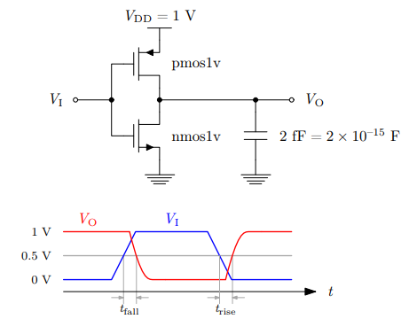{width="3.6127777777777776in" height="2.8225in"}

\(a\) The channel width of nmos1v is 120 nm. Let the channel width of pmos1v is pr×120 nm. Plot the DC transfer curves ($V_{O}$ vs. $V_{I}$) changing pr from 1 to 2 with a step size of 0.1. What is the value of pr that makes Vo closest to 0.5 V when VI = 0.5 V? pr = 1.2

**pr = 1.2 일 때 input 499.872mV, output 499.9237mV 로 가장 적합하다.**

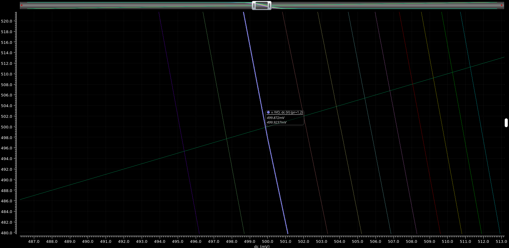{width="6.652361111111111in" height="3.2531944444444445in"}

**회로구성**

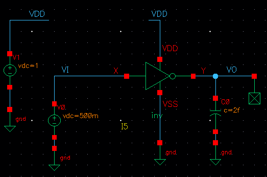{width="2.555972222222222in" height="1.6922222222222223in"}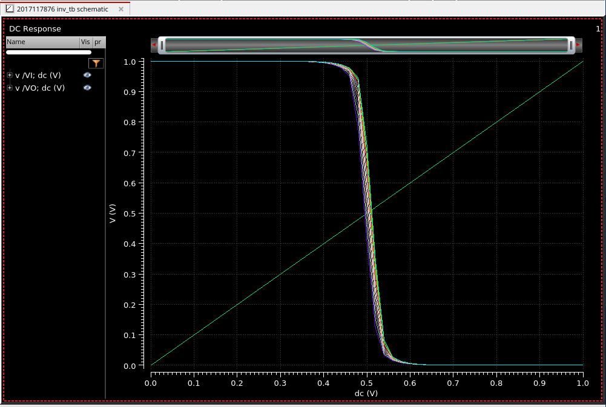{width="4.2813888888888885in" height="2.879166666666667in"}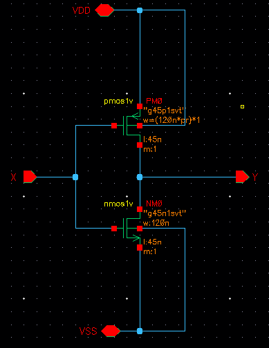{width="2.403888888888889in" height="3.116111111111111in"}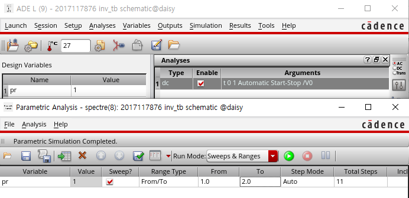{width="3.6572222222222224in" height="1.7715277777777778in"}

$V_{O}\,/V_{I}$ **출력 그래프**

**Inverter 내부**

**Virtuoso Simulation 설정**

\(b\) Find the minimum channel width of nmos1v that makes trise and tfall are both less than 10 ps. Use the pr value obtained in (a). Make sure that the rise/fall time of VI is less than 1 ps when run the 'tran' simulations. Width = 620nm

pr 은 (a)에서 구한 1.2를 그대로 사용하였다.

일반적으로 rise time $t_{r}$ 은 출력 신호 전압의 10%에서 90% 까지 올라가는데 걸리는 시간이다. 즉 0.1V \~ 0.9V 사이 동안 걸리는 시간을 뜻한다.

마찬가지로 fall time $t_{f}$ 은 출력 신호 전압의 90%에서 10% 까지 내려가는데 걸리는 시간이다. 즉 0.1V \~ 0.9V 사이 동안 걸리는 시간을 뜻한다.

만약 Propagation Delay를 구하는 것 이라면 입력이 rising 할 때 전압의 50%, 출력이 falling 할 때 전압의 50% 사이 동안의 걸리는 시간이 $t_{\text{pHL}}$ 이며

입력이 falling 할 때 전압의 50%, 출력이 rising 할 때 전압의 50% 사이 동안의 걸리는 시간이 $t_{\text{pLH}}$

이다.

$t_{f}$, $t_{\text{pHL}}$ 은 NMOS 특성에 영향을 받고, $t_{r}$와 $t_{\text{pLH}}$ 는 PMOS 특성에 영향을 받는다.

nmos1v 소자의 채널을 조절해서 $t_{f}$ 을 줄일 수 있고, pmos1v 소자의 채널을 조절해서 $t_{r}$ 을 줄일 수 있다.

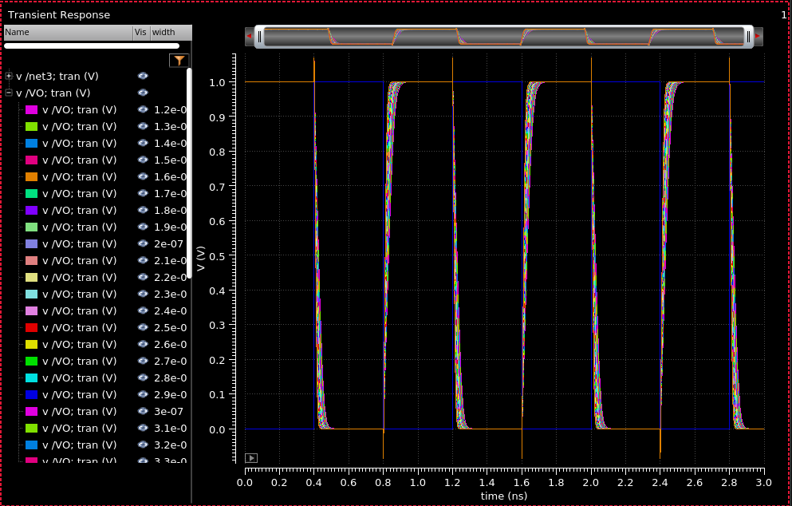{width="7.031805555555556in" height="4.494027777777778in"}

위 그림은 PMOS, NMOS의 Channel Width를 120nm\~520nm 까지 10nm 씩 증가시킨 plot 이다.

단, PMOS 는 pr (1.2) 가 곱해진 Channel Width 이다.

예상했던대로 Channel Width 가 증가할수록 $t_{f},\, t_{r}$ 에 큰 영향을 주고 있다.

Channel Width 가 증가할수록 $t_{f},\, t_{r}$ 가 단축되고 있다.

\< 과제에서 제안한 trise ($t_{\text{pLH}}$), tfall ($t_{\text{pHL}}$) 를 10 ps 이내로 맞추기 \>

**120nm 일 때** $t_{\text{pLH}}$ **= 30.9ps,** $t_{\text{pHL}}$ **= 26.448ps**

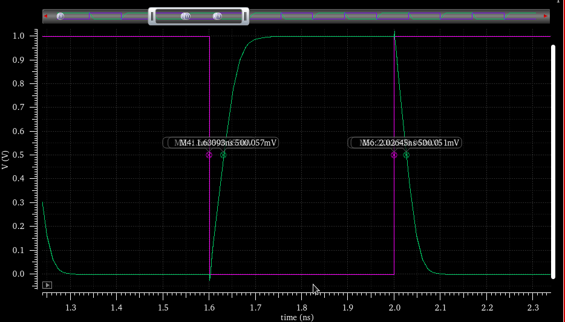{width="3.245416666666667in" height="2.7805555555555554in"}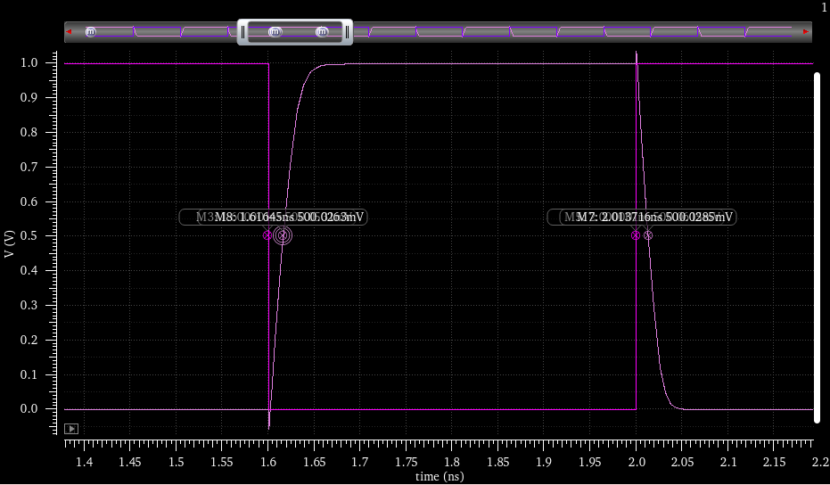{width="3.245416666666667in" height="2.7805555555555554in"}

**290nm 일 때** $t_{\text{pLH}}$ **= 16.45ps,** $t_{\text{pHL}}$ **= 13.71ps**

**400nm 일 때** $t_{\text{pLH}}$ **= 13.29ps,** $t_{\text{pHL}}$ **= 11.17ps**

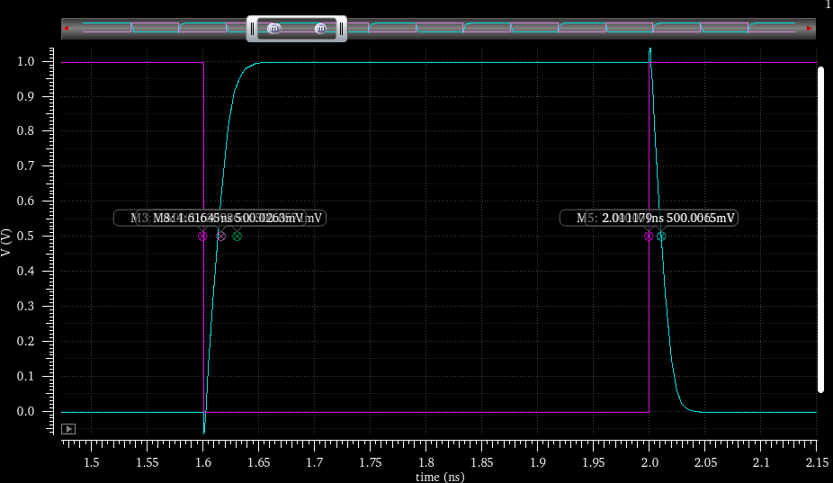{width="3.245416666666667in" height="2.7805555555555554in"}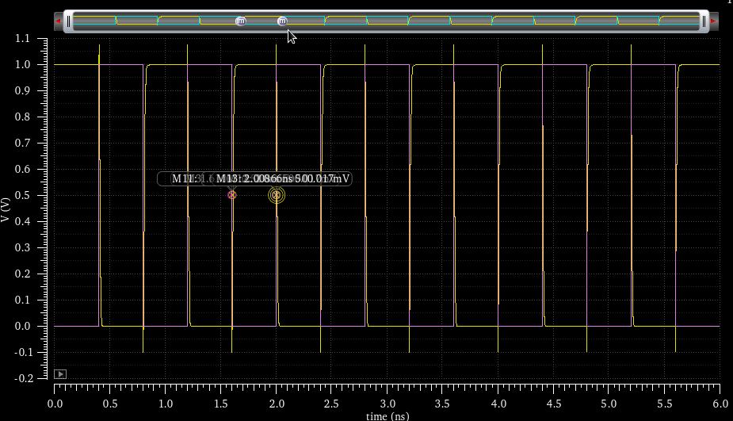{width="3.245416666666667in" height="2.7805555555555554in"}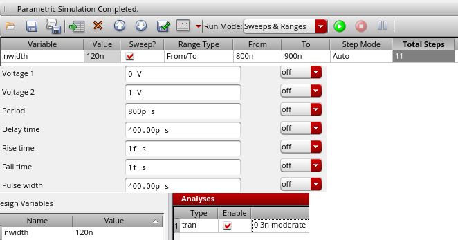{width="3.245416666666667in" height="1.3168055555555556in"}

**620nm 일 때** $t_{\text{pLH}}$ **= 10.00ps,** $t_{\text{pHL}}$ **= 8.65ps**

**vpulse 설정 값**

$t_{\text{pHL}}$ 은 $t_{\text{pLH}}$ 에 비해 상대적으로 빠르게 단축되었다.

620nm에서 10ps 이내로 작동이 가능하다.

**120nm 일 때** $t_{r}$ **= 58.51ps,** $t_{f}$ **= 50.3ps**

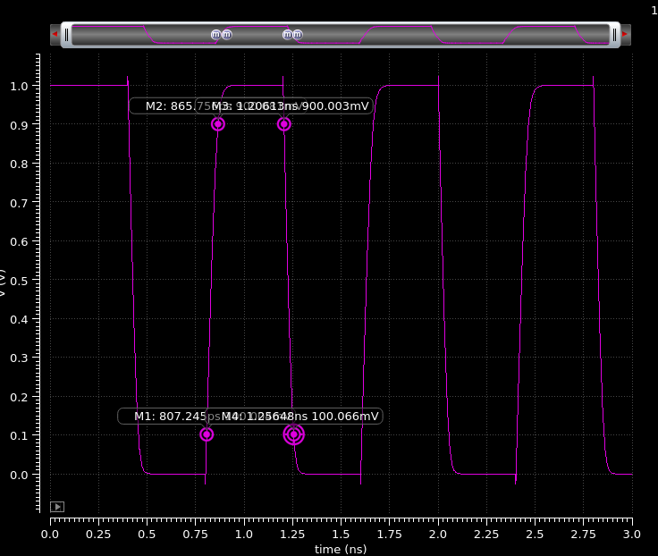{width="3.245416666666667in" height="2.7805555555555554in"}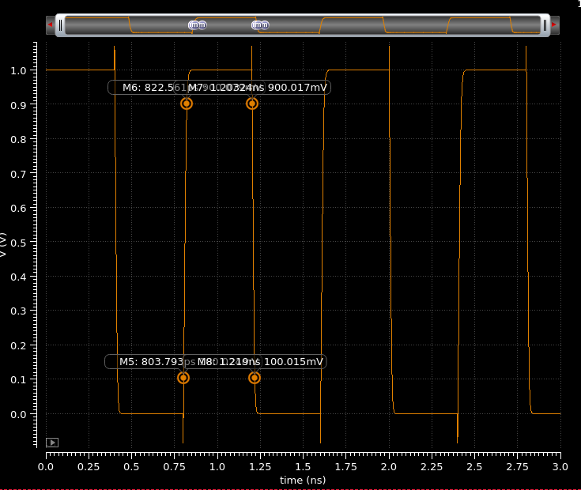{width="3.245416666666667in" height="2.7805555555555554in"}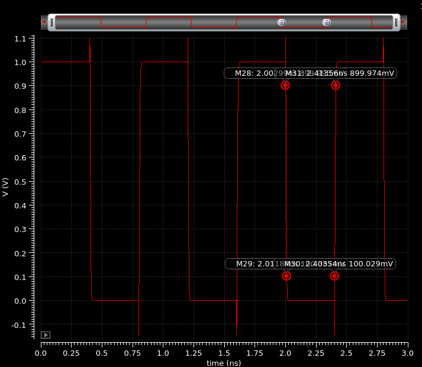{width="3.245416666666667in" height="2.7805555555555554in"}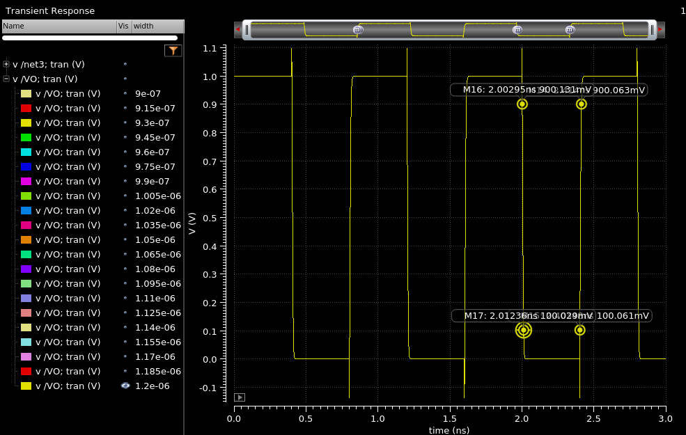{width="3.245416666666667in" height="2.7805555555555554in"}$t_{r}$, tfall을 $t_{f}$ 라고 가정시 \>

**520nm 일 때** $t_{r}$ **= 18.768ps,** $t_{f}$ **= 15.763ps**

**1350nm 일 때** $t_{r}$ **= 10ps,** $t_{f}$ **= 8.85ps**

**1200nm 일 때** $t_{r}$ **= 10.52ps,** $t_{f}$ **= 9.41ps**

$t_{f}$ 은 $t_{r}$ 에 비해 상대적으로 빠르게 단축되었다.

처음 120nm를 기준으로 시작한거에 비하면 엄청나게 Width 가 커졌다.

1350nm에서 10ps 이내로 작동이 가능하다.

IC 소자에서 Dynamic Power 소모가 커지고, 집적도 측면에서 불리할 것으로 판단된다.
