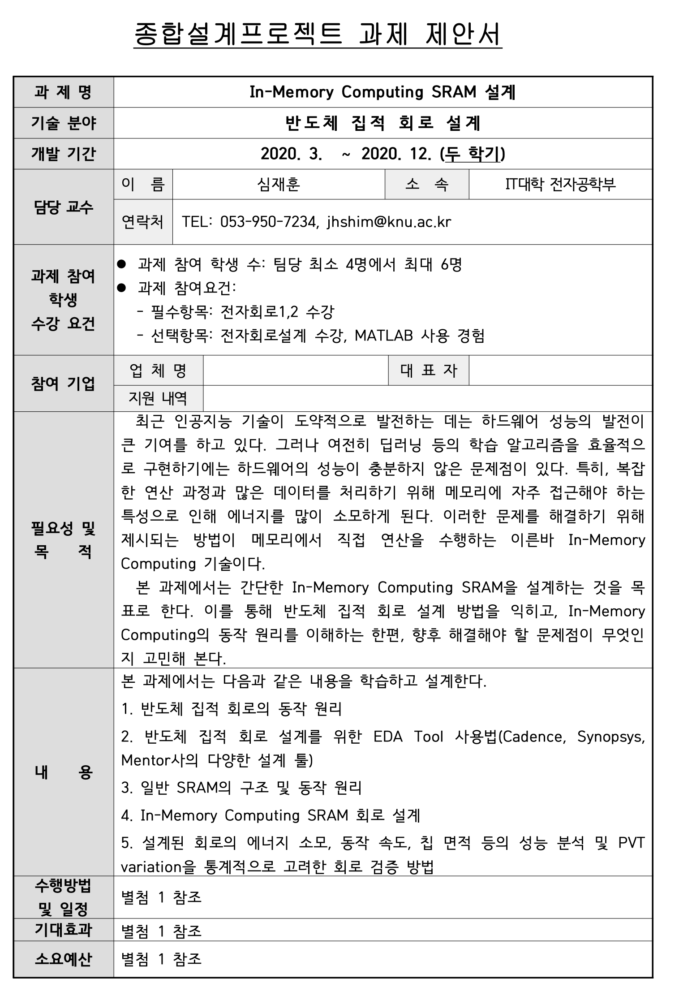
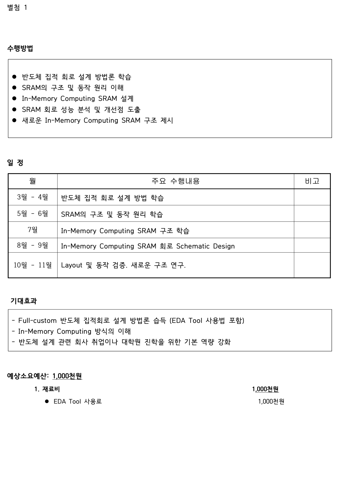

# 2020년도 1~2학기 : 종합설계프로젝트 (ITEC401011,ITEC402011)

* ## [과제 및 프로젝트 보기](HW/README.md)

* ## Repository 에 대한 설명

본 자료는 경북대학교 전자공학부 수업 중 2020년도 1~2학기에 진행중인 ‘심재훈’ 교수님의 ‘종합설계프로젝트’ 과목에 대한 정리이다.

상단의 폴더를 클릭하며 과제에 대한 설명과 해결 과정을 확인할 수 있다.

해당 주제는 In-Computing SRAM 64bit 설계이며 변동 내용이 있으면 수시로 수정이 된다.

아래의 표는 이 과목이 어떤 식으로 진행이 되었는지에 대한 강의계획서이다.

